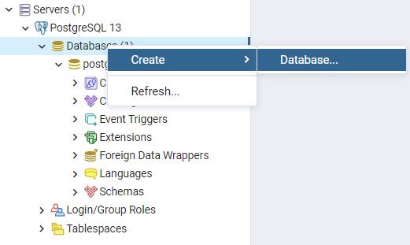
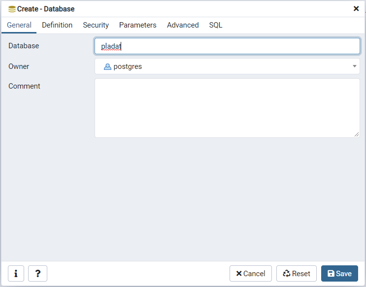

- [1. Project Proposal](#1-project-proposal)
  - [1.1 Project Abstract](#11-project-abstract)
  - [1.2 Project Scope](#12-project-scope)
  - [1.3 Project License](#13-project-license)
  - [1.4 Sponsor](#14-sponsor)
- [2. Project Structure](#2-project-structure)
  - [2.1 Project Team](#21-project-team)
- [2.2 Useful Links](#22-useful-links)
- [3. Project Stack](#3-project-stack)
  - [3.1 Technologies](#31-technologies)
- [4. Project setup](#4-project-setup)
  - [4.1 Frontend](#41-frontend)
  - [4.2 Backend](#42-backend)
  - [4.3 Database](#43-database)
  - [4.4 Testing](#44-testing)
  - [4.5 Important DEV notes:](#45-important-dev-notes)

---

## 1. Project Proposal

### 1.1 Project Abstract

This project will create a matching service to connect placement students with potential employers. Using a “dating” service metaphor, the site will allow employers to post details of placements available and students to apply for placements. 
The aim of the project is to create a database-driven mobile-friendly website to encourage employers and students to engage in year-long paid industrial placements as part of an honours degree programme. 

### 1.2 Project Scope

The project comprises three main elements: 

  - placement descriptions; 
  - student capabilities;
  - matching algorithm. 

Users (employers and students) will need to be able register with the site and store details of placements and capabilities. Some persistent storage will be required to retain placement details, student capabilities, and user credentials.

### 1.3 Project License

The project will be made available with an MIT license.

### 1.4 Sponsor

Julian M. Bass

Senior Lecturer (Associate Professor) of Software Engineering at the University of Salford, Manchester, UK

---

## 2. Project Structure
The project will follow a SCRUM-like agile method, which includes defining a SCRUM Master, a Product Owner and a Development Team. This definition of roles creates an initial distinction in tasks and duties for a successful delivery of the final software. 

### 2.1 Project Team

|         Name         |      Role     |                            University                                |  Email  |
|:--------------------:|:-------------:|:--------------------------------------------------------------------:|:-------:|  
| William Nordberg     | Product Owner | [Mälardalen University](https://www.mdh.se/en/malardalen-university) | [william.nordberg3@gmail.com](mailto:william.nordberg3@gmail.com)        |
| Bassam Zabad         | Developer     | [Mälardalen University](https://www.mdh.se/en/malardalen-university) | [bassam.zabad88@gmail.com](mailto:bassam.zabad88@gmail.com)           |
| Alice Casali         | Developer     | [Politecnico di Milano](https://www.polimi.it/)                      | [alice.casali@mail.polimi.it](mailto:alice.casali@mail.polimi.it)        |
| Fabrizio Siciliano   | SCRUM Master  | [Politecnico di Milano](https://www.polimi.it/)                      | [fabrizio.siciliano@mail.polimi.it](mailto:fabrizio.siciliano@mail.polimi.it)  |
| Aida Denisa Opîrlesc | Developer     | [Politecnico di Milano](https://www.polimi.it/)                      | [aidadenisa.opirlesc@mail.polimi.it](mailto:aidadenisa.opirlesc@mail.polimi.it) |
| Anna Bergamasco      | Developer     | [Politecnico di Milano](https://www.polimi.it/)                      | [anna.bergamasco@mail.polimi.it](mailto:anna.bergamasco@mail.polimi.it)     |
| Anđela Zorić         | Developer     | [Mälardalen University](https://www.mdh.se/en/malardalen-university) | [andjela.zoric@gmail.com](mailto:andjela.zoric@gmail.com)            |

## 2.2 Useful Links

- [Google Drive](https://drive.google.com/drive/folders/1uC0bpIpx8PbYAirWj4T_9s9fEPUDn9Cf?usp=sharing)
- [Discord Server](https://discord.gg/Rn4Ggnb)
- [Jira Board](https://pladat.atlassian.net/secure/RapidBoard.jspa?projectKey=PLAD&rapidView=1)
- [Figma Board](https://www.figma.com/files/project/16799299/PlaDat)

---

## 3. Project Stack

### 3.1 Technologies


> #### 3.1.1 Front-end
> [](https://flutter.dev/)

> #### 3.1.2 Back-end
> [](https://nodejs.org/en/)

> #### 3.1.3 Database
>  [](https://www.postgresql.org/)

> #### 3.1.4 Communication technology
>  [](https://restfulapi.net/)

> #### 3.1.5 Deployment and storage
>  [](https://www.heroku.com/)

--- 
## 4. Project setup
 
### 4.1 Frontend
 
Please make sure to satisfy the following requirements before the frontend setup: 
- Flutter is installed on your machine. If not, you can follow this guide [here](https://flutter.dev/docs/get-started/install);
- Your Flutter environment has to have web development enabled. You can do this by entering the following commands in your command line prompt of choice or follow this [step by step guide](https://flutter.dev/docs/get-started/web):
```
flutter channel beta
flutter upgrade
flutter config --enable-web
```
 
Once the requirements have been completed, please go ahead and follow the next steps:
- Open a command line prompt on your local machine and type `cd <path_to_project>/frontend`;
- Run the following command: `flutter build web`;
- Whenever you need to debug your application, you can use the following command: `flutter run -d chrome` (make sure to have Chrome installed).
 
### 4.2 Backend
 
Please make sure to satisfy the following requirements before the backend setup:
- Install Node.js and npm from this link [here](https://nodejs.org/en/);
 
Once the requirements have been completed, please go ahead and follow the next steps:
- Open a command line prompt on your local machine and type the following commands:
```
cd <path_to_project>/backend
npm i
npm start
```
- You should be able to check your backend by opening your browser of choice and navigating to the URL that is prompted after the `npm start`

### 4.3 Database
Please make sure to satisfy the following requirements before the backend setup:

- Install PostgreSQL from this link [here](https://www.postgresql.org/download/);
  - **NB: Take careful note of the password that you're going to give to postgres in the wizard while installing!**
- Install PGAdming4 from this link [here](https://www.pgadmin.org/download/);
- Make sure to have installed the `knex` package globally by running the following command in your prompt of choice:
```
npm i -g knex
```

Once the requirements have been completed, please go ahead and follow the next steps:
1. Create a new database:
   1. Fire up PGAdming 4, login and create a new database by right click on the database in your server, `Create > Database`;

   1. Insert the database name (of your choice) and keep that in mind;

   3. Save the new database;
2. Configure Node.js
   1. Open the backend folder of this project and create a new file called `.env`;
   2. Fill in the document with the following information by replacing the information with your own, keep the values in the double quotes:
```
DEV_DB_HOST="localhost"
DEV_DB_NAME="name_of_your_database"
DEV_DB_USR="your_username"
DEV_DB_PORT="port_of_your_database"
DEV_DB_PWD="your_password"
PLADAT_ENV="development" #do not change this
GPLACES_APIKEY="your_gplaces_api_key" #ask to our devs or create on of your own at https://developers.google.com/places/web-service/overview
ACCESS_TOKEN_SECRET="your_secret"
ACCESS_TOKEN_LIFE="your_token_life_in_seconds" #e.g. 2592000 = 30 days

```
   3. Check that everything is correct by doing the first migration:
```
cd <project_folder>/backend
knex migrate:latest 
```   
### 4.4 Testing
Make sure to have previously run the following commands:
```
cd <project_folder>/backend
npm i
```

Once the requirements have been completed, please go ahead and run `npm test`. All tests will be automatically run and you will be able to see the results on your prompt.

The backend comes together with a coverage checking function that can be easily run with `npm run coverage`. The results of it can be found inside the `./backend/.nyc_output` folder.
### 4.5 Important DEV notes:
- When testing the application from the dev branch, remember to run the frontend with the following command: 
```
flutter run -d chrome --dart-define=API_ENDPOINT=https://pladat-staging.herokuapp.com/
```

- If you're using VSCode and you wish to debug with just the push of a button, you can use the following in your launch.json file:
```
{
  "version": "0.2.0",
  "configurations": [
    {
      "name": "Local frontend",
      "cwd": "${workspaceFolder}/frontend",
      "request": "launch",
      "type": "dart",
      "args": ["--web-hostname=127.0.0.1", "--web-port=8200"]
    },
    {      
      "name": "Local backend",
      "request": "launch",
      "cwd": "${workspaceFolder}/backend",
      "runtimeArgs": [
        "run-script",
        "serve",
      ],
      "runtimeExecutable": "npm",
      "skipFiles": [
        "<node_internals>/**"
      ],
      "type": "pwa-node"
    },
    {
      "name": "PlaDat frontend staging",
      "cwd": "${workspaceFolder}/frontend",
      "request": "launch",
      "type": "dart",
      "args": [
        "--web-hostname=127.0.0.1",
        "--web-port=8200",
        "--dart-define=API_ENDPOINT=http://pladat-staging.herokuapp.com"
      ]
    },
    {
      "name": "PlaDat frontend production",
      "cwd": "${workspaceFolder}/frontend",
      "request": "launch",
      "type": "dart",
      "args": [
        "--web-hostname=127.0.0.1",
        "--web-port=8200",
        "--dart-define=API_ENDPOINT=https://pladat.herokuapp.com"
      ]
    }
  ],
  "compounds": [
    {
      "name": "Pladat development",
      "configurations": ["Local frontend", "Local backend"]
    }
  ]
}

```